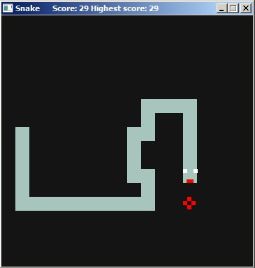
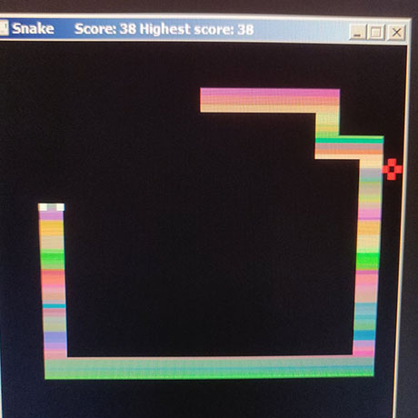

# Snake

Snake game written in C++ with SDL2. Code here is a implementation of classic like snake game. I have used [this code](https://gist.github.com/olevegard/e1ce53d9302c4ed3be8d#file-simple-opengl-test-cpp) and extended it.

# Screenshots

# About the game
The Sanke  was intened to be classic snake game but I wanted to make it more dynamical and I ended up allowing user to force snake move not as it was in classic version when snake was moving only one time per frame or half a second. 
Of course snake is forced to move once time per half a second but when player use controlls it make next move much time faster.

# How to play
From ``Debug`` dictionary download ``SDL2.dll`` and ``Snake.exe`` place it in the same dictionary then just run ``Snake.exe``

## Controlls
1. To move use either wsad or arrow keys.
2. Space to speed up.

## Cheats
1. Press ``k`` to extend snake by one.
2. Press ``j`` to enable **rainbow mode aka epilepsy mode**

# About the code
The game itself has two objects Apple and Snake in which are stored all positions data. All the magic happends in RunGame function. I think the code is pretty much self explanatory.
There is one interesting thing about rainbow mode and that is how it works. The Snake colors are being changed every frame that fast they make an illusion of rainbow.
Picture to show how it looks like in real life:

# How to run code in Visual Studio
1. Download repository.
2. Run Snake.sln
3. Click right mouse button on ``Snake`` in ``Solution Explorer`` and choose ``Properties``
4. Then choose C/C++ -> Additional Include Directories -> Edit -> and then add two directories from ``Dependencies`` directory SDL2/include and GLFW/include.
5. Now choose Linker -> Addional Libary Directories -> Edit -> and then add directories SDL2/lib/x86 and GLFW/lib/Release/Win32.
6. Then choose Linker -> Input -> Additional Dependencies and type there ``SDL2.lib SDL2main.lib``
7. Now choose Linker -> System -> SubSysten -> there from the menu choose ``Windows (/SUBSYSTEM:WINDOWS)``
8. Press Apply/OK and everything should be working from now.

DO NOT FORGET TO RUN IN X86(32 bit) MODE! If you want to run in x64 you have to choose in configuration profile x64 and then from ``point 5`` choose libaries for x64.

# License 
MIT